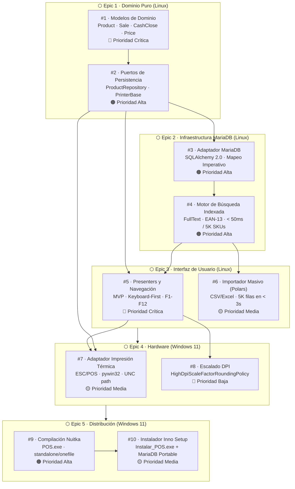
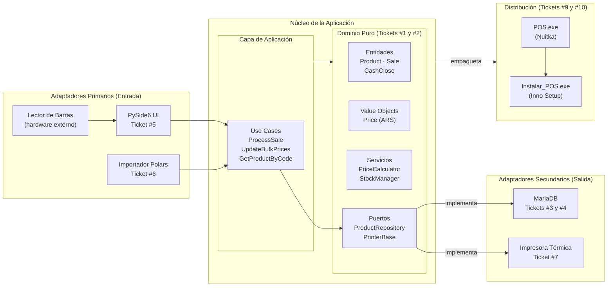
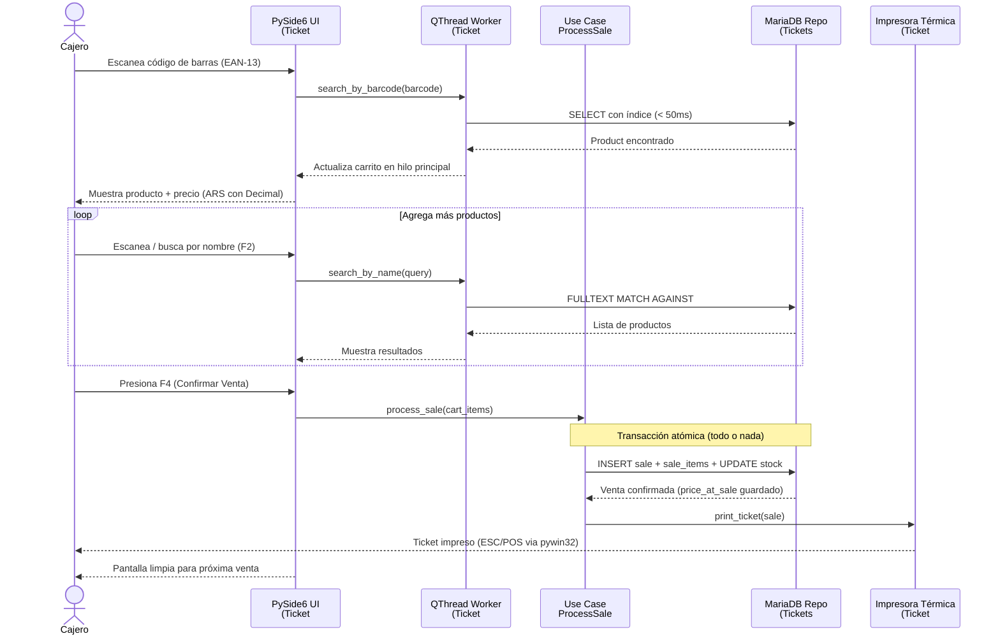
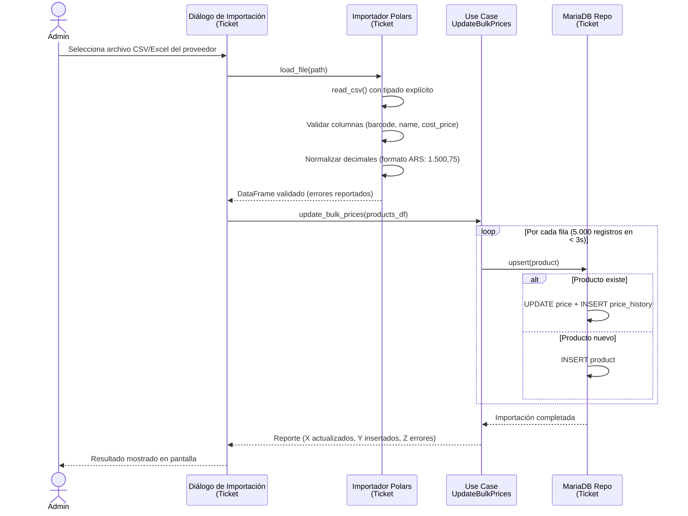
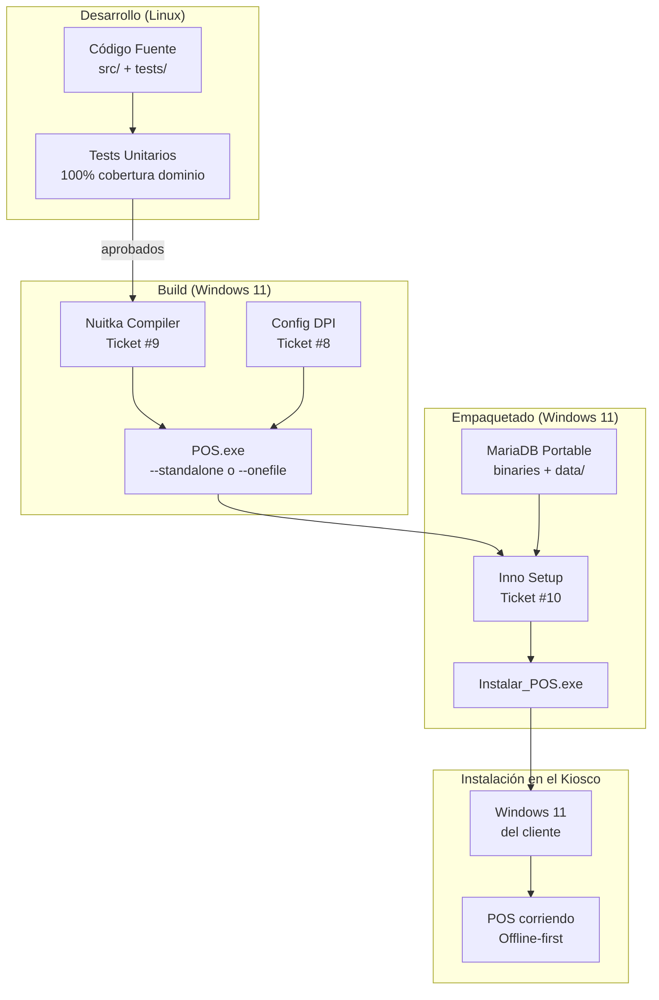

# Flujo de Trabajo del Proyecto POS

Diagrama completo del ciclo de desarrollo, desde el dominio puro hasta la distribución final.
Cubre los 5 epics y 10 tickets del plan de ejecución.

---

## 1. Secuencia de Desarrollo (Dependencias entre Tickets)

---

## 2. Arquitectura Hexagonal (Flujo de Datos)

---

## 3. Ciclo de Vida de una Venta

---

## 4. Ciclo de Importación Masiva de Precios

---

## 5. Pipeline de Distribución

---

## 6. Resumen por Epic y Entorno

```mermaid
gantt
    title Plan de Ejecución — Tickets por Epic
    dateFormat  X
    axisFormat  %s

    section Epic 1 · Dominio (Linux)
    #1 Modelos de Dominio          :crit, t11, 0, 1
    #2 Puertos de Persistencia     :t12, after t11, 1

    section Epic 2 · Infraestructura (Linux)
    #3 Adaptador MariaDB           :t21, after t12, 1
    #4 Motor de Búsqueda           :t22, after t21, 1

    section Epic 3 · UI (Linux)
    #5 Presenters Keyboard-First   :crit, t31, after t12, 2
    #6 Importador Polars           :t32, after t22, 1

    section Epic 4 · Hardware (Windows)
    #7 Impresión Térmica           :t41, after t31, 1
    #8 Escalado DPI                :t42, after t31, 1

    section Epic 5 · Distribución (Windows)
    #9 Compilación Nuitka          :t51, after t41, 1
    #10 Instalador Inno Setup      :t52, after t51, 1
```

---

## Referencias

- Plan de Ejecución → [`doc/plan-de-ejecucion.md`](./plan-de-ejecucion.md)
- Aspectos Técnicos → [`doc/aspectos-tecnicos.md`](./aspectos-tecnicos.md)
- Issues del proyecto → [github.com/gustavoJimenezz/mostrador-kiosco-punto-de-venta/issues](https://github.com/gustavoJimenezz/mostrador-kiosco-punto-de-venta/issues)
